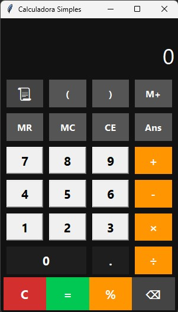

# 🧮 Calculadora Simples

Uma calculadora desktop feita em Python com interface gráfica (Tkinter),
desenvolvida em 3 versões — do script simples no terminal até uma GUI completa.



## ✨ Funcionalidades

- Operações básicas: soma, subtração, multiplicação, divisão
- Suporte a expressões com parênteses: `(2+3)*4`
- Potência e raiz quadrada
- Porcentagem
- Memória (M+, MR, MC)
- Histórico persistente salvo em arquivo `.txt`
- Exportar histórico para `.csv`
- Teclas de atalho (Enter, Backspace, Esc, letras)

## 🗂️ Estrutura do projeto

## 🚀 Como executar

```bash
# Clone o repositório
git clone https://github.com/seu-usuario/calculadora-simples.git
cd calculadora-simples

# Instale as dependências
pip install -r requirements.txt

# Interface gráfica
python main.py

# Versão terminal
python calculadora_terminal.py
```

## 🧪 Testes

```bash
pytest test_engine.py -v
```

## 🛠️ Tecnologias

- Python 3.10+
- Tkinter (GUI)
- pytest (testes)

## 📈 Evolução do projeto

| Versão | Descrição |
|--------|-----------|
| v1.0 | Calculadora básica no terminal |
| v2.0 | Histórico, memória e exportação CSV |
| v3.0 | Interface gráfica com Tkinter e engine separada |

## Créditos do ícone
Ícone criado por [logisstudio](https://www.flaticon.com/authors/logisstudio) via [Flaticon](https://www.flaticon.com)
